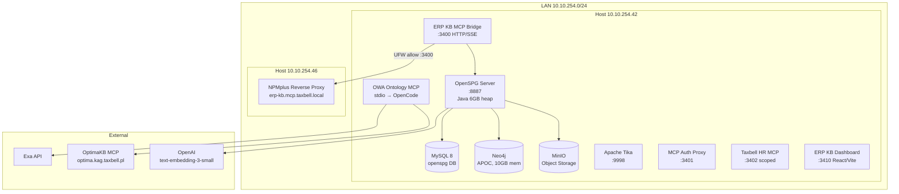
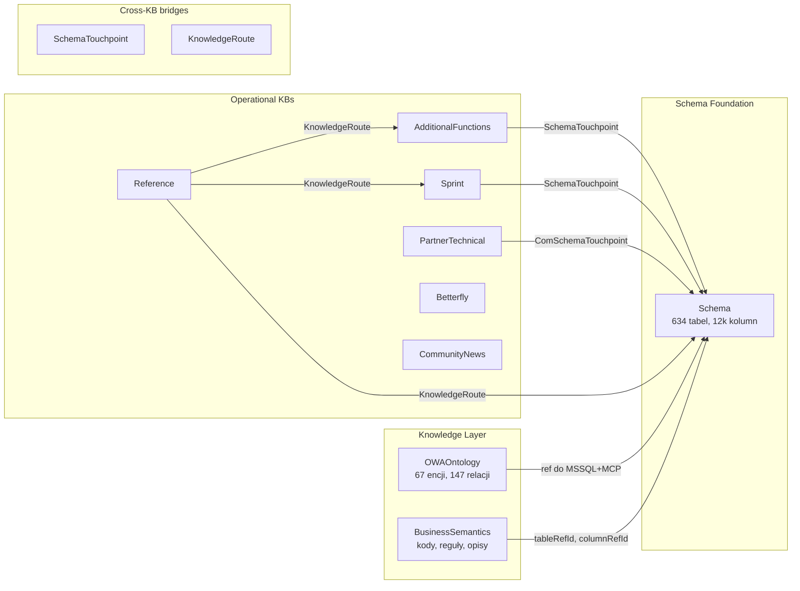

# AUDIT: OPENSPG/KAG ERP KNOWLEDGE BASE + MCP

## 1. Metadane audytu

| Pole | Wartość |
|---|---|
| Data | 2026-07-18 |
| Audytor | OpenCode (agent audytu technicznego) |
| Commit | `a66d69ecc7c86e063f77ba2491487d8c4be03fe9` |
| Branch | `main` |
| Tryb | Read-only |
| Stan API | Online (10.10.254.42:8887, auth wymagany do większości endpointów) |
| API auth | Sesja OpenSPG przez cookie (nie zweryfikowano bezpośrednio z powodu braku aktywnej sesji) |

## 2. Executive Summary

Platforma OpenSPG/KAG na serwerze `10.10.254.42` jest **operacyjnie sprawna i wykracza poza fazę proof-of-concept**. Stan na dzień audytu:

- **13 skonfigurowanych Knowledge Bases** w rejestrze dashboardu, z czego 8 w produkcji (READY/GOOD), 3 Taxbell w pierwszej wersji, 1 uniwersalna, 1 ontologiczna (OWA).
- **Ponad 260 zadań buildera** zakończonych sukcesem, potwierdzających poprawne działanie pipeline'u CSV -> upload -> builder job -> Neo4j.
- **Warstwa asystenta** (routing + odpowiedzi) działa na poziomie lokalnym, przechodząc 200/200 PASS na syntetycznym benchmarku.
- **MCP HTTP bridge** jest produkcyjnie wystawiony na `10.10.254.42:3400` za NPMplus (10.10.254.46), z bearer-auth i rate limitingiem.
- **Aplikacja OpenSPG** (app id=2) opublikowana ale nieoperacyjna z powodu błędu `projectId=2` w backendzie.
- **OWA Ontology MCP** (v2.0.0) działa jako samo-uczący się serwer MCP z write-back do CSV i integracją z Exa/OptimaKB.

Główne luki:
- Brak kanonicznej ontologii ERP łączącej wszystkie projekty w spójny model konceptualny (OWAOntology to pierwszy krok, ale dopiero draft).
- Retrieval/Reasoning przez OpenSPG KAG nie został zweryfikowany end-to-end z powodu błędu w aplikacji.
- Brak multi-tenancy na poziomie danych — wszystkie KB współdzielą ten sam klaster Neo4j.
- Procesy biznesowe istnieją głównie jako dokumentacja (chunki), nie jako operacyjny graf reguł.

## 3. Status i kompletność audytu

| Sekcja | Status weryfikacji | Uwagi |
|---|---|---|
| Infrastruktura | ZWERYFIKOWANE | Docker Compose, stan kontenerów, konfiguracja |
| Projekty i KB | ZWERYFIKOWANE | Schema files, export manifests, build jobs |
| Artefakty | ZWERYFIKOWANE | CSV staging, dokumentacja |
| Schematy i ontologie | ZWERYFIKOWANE | Wszystkie pliki `.schema` |
| Domeny ERP/CRM | CZĘŚCIOWO ZWERYFIKOWANE | Pokrycie oszacowane na podstawie struktury CSV |
| Procesy biznesowe | CZĘŚCIOWO ZWERYFIKOWANE | Workflow patterns w OWA, dokumentacja procesów w Optimie |
| Pipeline budowy | ZWERYFIKOWANE | Build runner, profile, manifesty |
| KAG/Retrieval | CZĘŚCIOWO ZWERYFIKOWANE | API niedostępne bez auth; app działa tylko na poziomie publikacji |
| MCP | ZWERYFIKOWANE | Kod źródłowy, konfiguracja, rejestr |
| Multi-tenancy | WNIOSKOWANE | Brak izolacji na poziomie Neo4j |
| Provenance | CZĘŚCIOWO ZWERYFIKOWANE | sourceUrl/sourceOrigin istnieją w schematach, brak systemowego versionowania |
| Testy | ZWERYFIKOWANE | Testpacki, benchmarki, community thread test |

## 4. Diagram architektury (Mermaid)



## 5. Inwentarz usług i wersji

| Usługa | Obraz / Wersja | Rola | Port | Zasoby |
|---|---|---|---|---|
| OpenSPG Server | `openspg-server` (build ~2026-05-21) | API, builder, KAG | 10.10.254.42:8887 | 6GB RAM, 3-6GB JVM heap |
| MySQL | `openspg-mysql` (MySQL 8) | Relacyjny storage OpenSPG | wewn. 3306 | 2GB RAM |
| Neo4j | `openspg-neo4j` (z APOC) | Graph store + search engine | wewn. 7687 | 10GB RAM, 4GB heap, 2GB pagecache |
| MinIO | `openspg-minio` | Object storage (CSV uploads) | wewn. 9000 | 1GB RAM |
| Apache Tika | `apache/tika:latest` | OCR/ekstrakcja tekstu | 127.0.0.1:9998 | 2GB RAM |
| ERP KB Dashboard | `scripts/erp_kb_dashboard_server.mjs` | Panel operatorski | 10.10.254.42:3410 | Node.js |
| ERP KB MCP Bridge | `scripts/erp_knowledge_mcp_http_bridge.mjs` | MCP HTTP/SSE bridge | 10.10.254.42:3400 | Node.js |
| OWA Ontology MCP | `scripts/owa_ontology_mcp_server.mjs` (v2.0.0) | Samo-uczący się MCP | stdio (OpenCode) | Node.js |

**LLM / Embeddingi:**
- Embedding: `text-embedding-3-small` (OpenAI, model ID `b87d551d4ba14909907c6e29218fa011`)
- App pipeline: `think_pipeline` (potwierdzone działanie), `kag_thinker_pipeline` (niestabilne)
- LLM dla aplikacji: konfigurowalny przez `config.llm` w app (model nie potwierdzony bezpośrednio)

**Środowiska:**
- Tylko jedno środowisko (produkcyjne na 10.10.254.42)
- Brak wydzielonego dev/staging

## 6. Katalog projektów

| Project ID | Nazwa | Namespace | Cel | Schema | Encje (typ) | Status |
|---|---|---|---|---|---|---|
| 4 | Comarch Optima ERP MSSQL Schema | `ComarchOptimaSchema` | Metadane schematu MSSQL | `ComarchOptimaSchema.schema` | 18 typów encji + 4 taksonomie | READY |
| 6 | Comarch Optima Additional Functions | `ComarchOptimaAdditionalFunctions` | Funkcje dodatkowe, COM, słowniki | `ComarchOptimaAdditionalFunctions.schema` | 17 typów encji | READY |
| 7 | Comarch Optima Sprint and Prints | `ComarchOptimaSprint` | Wydruki, sPrint, raporty | `ComarchOptimaSprint.schema` | 15 typów encji | GOOD |
| 8 | Comarch Optima Reference | `ComarchOptimaReference` | Oficjalna dokumentacja Optima | `ComarchOptimaReference.schema` | 8 typów encji | READY |
| 9 | Comarch Optima Partner Technical | `ComarchOptimaPartnerTechnical` | Portal partnerski, słowniki, XML | `ComarchOptimaPartnerTechnical.schema` | 15 typów encji | GOOD |
| 10 | Comarch Betterfly Reference | `ComarchBetterflyReference` | Dokumentacja API Betterfly | `ComarchBetterflyReference.schema` | 9 typów encji | READY |
| 11 | Comarch Community News | `ComarchCommunityNews` | Aktualności społeczności Comarch | `ComarchCommunityNews.schema` | 6 typów encji | GOOD |
| 12 | Taxbell Legal Reference | `TaxbellLegalReference` | Prawo podatkowe, interpretacje | `TaxbellLegalReference.schema` | 5 typów encji (szac.) | GOOD |
| 13 | Taxbell Payroll HR Reference | `TaxbellPayrollHRReference` | Kadry, płace, ZUS | `TaxbellPayrollHRReference.schema` | 5 typów encji (szac.) | GOOD |
| 14 | Taxbell Accounting VAT Reference | `TaxbellAccountingVATReference` | Księgowość, VAT, JPK | `TaxbellAccountingVATReference.schema` | 5 typów encji (szac.) | GOOD |
| 15 | Comarch Optima Business Semantics | `ComarchOptimaBusinessSemantics` | Semantyka biznesowa, kody, reguły | `ComarchOptimaBusinessSemantics.schema` | 3 typy encji + 1 taksonomia | READY |
| 16 | OWA Platform Optima Ontology | `OWAOntology` | Ontologia kanoniczna ERP Optima | `OWAOntology.schema` | 4 typy encji + 1 taksonomia | GOOD (first_build_complete) |
| — | Comarch Universal Knowledge | `ComarchUniversalKnowledge` | Wiedza uniwersalna (catch-all) | brak dedykowanego | 2 typy encji (szac.) | BASIC |

**Uwagi:**
- Projekty 1-3 zostały usunięte i zastąpione przez 4
- Projekty 12-14 (Taxbell) współdzielą implementację buildera przez `taxbell_reference_config.mjs`
- `OWAOntology` jest najnowszym projektem (zbudowany 2026-07-17)

## 7. Katalog źródeł i artefaktów

### Główne źródła

| Źródło | Format | Źródło danych | KB |
|---|---|---|---|
| MSSQL `CDN_TEST` + `CDN_KNF_Konfiguracja` | Katalog metadanych SQL | Codex MCP MSSQL | Schema (4) |
| Google Drive — Additional Functions | PDF, Markdown, JS, XPT | Manual download | AdditionalFunctions (6) |
| Google Drive — Sprint | PDF, Markdown | Manual download | Sprint (7) |
| `pomoc.comarch.pl` | HTML (sitemap WordPress) | Web fetch | Reference (8) |
| `partner.erp.comarch.pl` | WordPress REST API, ZIP, PDF | Partner portal (auth cookie) | PartnerTechnical (9) |
| `pomoc.comarch.pl/betterfly` | HTML, API docs | Web fetch | Betterfly (10) |
| `spolecznosc.comarch.pl` | HTML (Chromium headless) | Web fetch | CommunityNews (11) |
| Publiczne źródła podatkowe | HTML (Exa crawl) | Exa search | Taxbell (12-14) |
| Manual exports z Optima UI | XML (`export_fd.xml`, `export_wydruki.xml`) | Eksport z aplikacji | AdditionalFunctions, Sprint |
| OWA Ontology drafts | JSON/Markdown (knowledge_inbox) | OWA MCP auto-generacja | OWAOntology (16) |

### Główne artefakty stagingu (CSV)

| Artefakt | Projekt | Wiersze (przybliżone) | Cel |
|---|---|---|---|
| `table.csv` + `column.csv` | Schema (4) | 634 + 12,426 | Katalog tabel i kolumn |
| `foreign_key.csv` | Schema (4) | 609 | Relacje FK |
| `stored_procedure.csv` + `function.csv` + `trigger.csv` | Schema (4) | 1,367 + 743 + 449 | Obiekty SQL |
| `table_query_guide.csv` | Schema (4) | 634 | Helper projektowania zapytań |
| `join_path_guide.csv` | Schema (4) | 621 | Ścieżki JOIN |
| `sql_object_guide.csv` | Schema (4) | 2,608 | Klasyfikacja obiektów SQL |
| `object_dependency.csv` | Schema (4) | 14,113 | Zależności między obiektami |
| `configuration_catalog_entry.csv` | AdditionalFunctions (6) | 1,740 | Słownik konfiguracji |
| `procedure_dictionary_entry.csv` | AdditionalFunctions (6) | 1,442 | Słownik procedur |
| `message_catalog_entry.csv` | AdditionalFunctions (6) | 7,061 | Katalog komunikatów |
| `reference_document.csv` | Reference (8) | 3,364 | Dokumenty referencyjne |
| `partner_asset.csv` | PartnerTechnical (9) | 548 | Aktywa partnerskie |
| `cfg_entry.csv` | PartnerTechnical (9) | 5,149 | Wpisy słownika konfiguracji |
| `msg_entry.csv` | PartnerTechnical (9) | 21,140 | Wpisy słownika komunikatów |
| `ontology_entity.csv` | OWAOntology (16) | 67 | Encje ontologiczne |
| `ontology_field.csv` | OWAOntology (16) | 109 | Mapowania pól MCP→MSSQL |
| `ontology_relation.csv` | OWAOntology (16) | 147 | Relacje ontologiczne |
| `workflow_pattern.csv` | OWAOntology (16) | 0 | Wzorce workflow (puste) |

## 8. Istniejące ontologie i schematy

### Przegląd wszystkich typów w systemie

**Taksonomie (ConceptType):**
- `TaxoOfDatabaseRole`, `TaxoOfDbObjectKind`, `TaxoOfConstraintType`, `TaxoOfDependencyType` (Schema)
- `TaxoOfOntologyCategory` (OWAOntology)
- `BusinessDomain` (BusinessSemantics)
- Pozostałe taksonomie zdefiniowane per-KB przez `hypernymPredicate: isA`

**Typy encji — Schema (4):**
`DatabaseInstance`, `Table`, `Column`, `PrimaryKey`, `ForeignKey`, `Index`, `Constraint`, `View`, `StoredProcedure`, `Function`, `Trigger`, `Parameter`, `ObjectDependency`, `TableQueryGuide`, `JoinPathGuide`, `SqlObjectGuide`, `SchemaChange`, `Chunk`

**Typy encji — AdditionalFunctions (6):**
`ReferenceDocument`, `FunctionCapability`, `FunctionEntryPoint`, `FunctionExecutionMode`, `FunctionConfigOption`, `FunctionRule`, `FunctionPattern`, `RelatedFeature`, `FileArtifact`, `ImplementationExample`, `ComInterface`, `ConfigurationCatalogEntry`, `ProcedureDictionaryEntry`, `MessageCatalogEntry`, `ImplementationGuide`, `SchemaTouchpoint`, `ModuleRecipe`, `Chunk`

**Typy encji — Sprint (7):**
`ReferenceDocument`, `FileArtifact`, `PrintTechnology`, `PrintWorkflow`, `PrintOption`, `TemplateFeature`, `SqlPattern`, `DiagnosticCase`, `VersionChange`, `PrintCatalog`, `LearningResource`, `GlossaryTerm`, `SchemaTouchpoint`, `ModuleRecipe`, `Chunk`

**Typy encji — Reference (8):**
`ReferenceDocument`, `HelpCategory`, `ModuleArea`, `VersionTopic`, `LearningGuide`, `KnowledgeRoute`, `EntryGuide`, `Chunk`

**Typy encji — PartnerTechnical (9):**
`ReferenceDocument`, `PartnerCategory`, `PartnerAsset`, `AssetType`, `VersionBand`, `ProductArea`, `CfgEntry`, `ProcEntry`, `MsgEntry`, `ComExample`, `ComInterfaceUse`, `ComSchemaTouchpoint`, `ComModuleRecipe`, `KnowledgeRoute`, `Chunk`

**Typy encji — Betterfly (10):**
`ReferenceDocument`, `HelpCategory`, `ModuleArea`, `ApiResource`, `ApiPattern`, `LearningGuide`, `KnowledgeRoute`, `EntryGuide`, `Chunk`

**Typy encji — BusinessSemantics (15):**
`BusinessDescription`, `CodeMeaning`, `BusinessRule`

**Typy encji — OWAOntology (16):**
`OntologyEntity`, `OntologyField`, `OntologyRelation`, `WorkflowPattern`, `Chunk`

**Typy encji — CommunityNews (11):**
`ReferenceDocument`, `NewsTopic`, `CommunityAttachment`, `KnowledgeRoute`, `EntryGuide`, `Chunk`

### Ocena ontologii kanonicznej ERP

**Brak pojedynczej kanonicznej ontologii łączącej wszystkie KB.** Każda KB operuje na własnym, niezależnym schemacie w odrębnej bazie Neo4j. Wyjątki:

1. `SchemaTouchpoint` i `ComSchemaTouchpoint` — mosty między KB operacyjnymi a Schema KB (ref-id do projektu 4)
2. `KnowledgeRoute` — routing między KB (np. z Reference do Schema)
3. `OWAOntology` — pierwsza próba ontologii kanonicznej, ale w fazie draft (67 encji, 109 pól, 147 relacji, 0 workflow patterns)

Model **nie odróżnia** jawnie: `BusinessConcept`, `BusinessEntity`, `State`, `BusinessEvent`, `Process`, `ProcessStep`, `BusinessRule`, `Capability`, `ApiOperation`, `McpTool`, `DatabaseTable`, `DatabaseColumn`, `ErrorCode`, `Regulation`, `KnowledgeSource`.

Model **częściowo odróżnia**: `DocumentType` i `Document` (poprzez semanticType na ReferenceDocument), `VendorProduct` i `VendorObject` (OWAOntology mapuje MSSQL + MCP).

## 9. Pełny katalog typów i relacji

### Relacje (właściwości referencyjne)

Wszystkie relacje w systemie są modelowane przez **właściwości RefId** na encjach (np. `tableRefId`, `entityRefId`, `sourceDocumentRefId`), ponieważ OpenSPG nie materializuje niestandardowych linii relacji ze skryptu schematu (potwierdzony bug API).

**Mapa zależności ontologii:**



## 10. Pokrycie domen ERP/CRM

| Obszar | Ontologia | Dokumentacja | Procesy | Reguły | Mapowanie Optima | Testy | Ocena jakości |
|---|---|---|---|---|---|---|---|
| Kontrahenci i kontakty | Częściowo (OWA) | Tak (Chunki) | Nie | Nie | Tak (TraNag/TraElem) | Częściowo | Średnia |
| Towary i usługi | Częściowo (OWA) | Tak (Chunki) | Nie | Nie | Tak (Towary) | Częściowo | Średnia |
| Ceny i rabaty | Nie | Nie | Nie | Nie | Częściowo | Nie | Niska |
| Magazyny i stany | Nie | Nie | Nie | Nie | Częściowo | Nie | Niska |
| Sprzedaż i zakupy | Częściowo (OWA) | Tak (Betterfly API) | Nie | Nie | Tak | Częściowo | Średnia |
| Dokumenty handlowe | Częściowo (OWA) | Tak (Chunki) | Nie | Nie | Tak (SekNag/SekElem) | Częściowo | Średnia |
| Płatności i rozliczenia | Częściowo (OWA) | Tak (Betterfly API) | Nie | Nie | Tak | Nie | Niska |
| CRM | Nie | Nie | Nie | Nie | Częściowo | Nie | Niska |
| Księgowość i VAT | Nie | Tak (Taxbell) | Nie | Nie | Częściowo | Nie | Niska |
| KSeF/JPK | Częściowo | Tak (Partner, Taxbell) | Nie | Nie | Częściowo | Nie | Niska |
| Środki trwałe | Nie | Nie | Nie | Nie | Częściowo | Nie | Niska |
| Kadry i płace | Nie | Tak (Taxbell) | Nie | Nie | Częściowo | Nie | Niska |

**Wniosek:** Platforma ma silne pokrycie metadanych technicznych (schemat MSSQL, funkcje dodatkowe, wydruki, API) ale niskie pokrycie procesów biznesowych i reguł. Taxbell KB dostarczają wiedzę domenową dla księgowości, kadr i prawa.

## 11. Pokrycie procesów biznesowych

| Proces | Intencje/Aktorzy | Dokumentacja | Graf/Reguły | Status |
|---|---|---|---|---|
| Order-to-Cash | Częściowo (OWA WorkflowPatterns) | Tak (Betterfly API, Optima docs) | Nie | Dokumentacja tylko |
| Procure-to-Pay | Nie | Częściowo | Nie | Niezaimplementowany |
| Inventory Management | Nie | Nie | Nie | Niezaimplementowany |
| Payment and Settlement | Częściowo (OWA) | Tak (Betterfly API patterns) | Nie | Dokumentacja tylko |
| Lead-to-Opportunity | Nie | Nie | Nie | Niezaimplementowany |
| Record-to-Report | Nie | Tak (Taxbell) | Nie | Dokumentacja tylko |
| KSeF/JPK | Częściowo | Tak (Partner, Taxbell) | Nie | Dokumentacja tylko |

**Workflow patterns w OWAOntology:** 0 wierszy w `workflow_pattern.csv` (ekstrakcja nie została jeszcze zmaterializowana z draftów Markdown). W kodzie OWA MCP serwera istnieje narzędzie `add_owa_workflow` do ręcznego dodawania.

## 12. Pipeline budowy wiedzy

### Pipeline per KB

```
Schema (.schema file) → push_openspg_schema.mjs → export_{kb}.mjs → build_{kb}.mjs
                                                         ↓
                                              uploadFile (MinIO)
                                                         ↓
                                              builder/job/submit (OpenSPG)
                                                         ↓
                                              Neo4j (graph store)
```

### Implementacja

- **Unified build runner:** `scripts/build_kb_runner.mjs` — 10 profili (optima_reference, optima_additional_functions, optima_sprint, optima_partner_technical, optima_schema_metadata, optima_business_semantics, betterfly_reference, community_news, taxbell_reference, owa_ontology)
- **Pozyskiwanie źródeł:** manualne + skrypty download (`download_comarch_community_news.mjs`, `download_optima_partner_technical_assets.mjs`)
- **Ekstrakcja tekstu:** Apache Tika (PDF OCR), `pdf_text.mjs`, `extract_optima_partner_technical_archives.mjs` (ZIP, nested ZIP)
- **Chunking:** wykonywany przez eksportery; chunk CSV kolumna `content` z indeksem `TextAndVector`
- **Embedding:** `text-embedding-3-small` (OpenAI)
- **Vector store:** Neo4j (przez `TextAndVector` na właściwościach)

### Ograniczenia

- Brak wsparcia dla MSSQL connector w tej instancji OpenSPG (tylko ODPS i SLS)
- Relacje niestandardowe nie są materializowane w grafie (bug API)
- Duże definicje SQL (>8192 tokenów) powodują błędy vectorization
- `kag_thinker_pipeline` niestabilny (brakuje `rewrite_prompt`)

### Odtwarzalność

Wszystkie staging CSV i manifesty build jobów są przechowywane w `exports/` i `docs/reference/`. Graf może być odtworzony od zera przez re-run pipeline'u. Nie znaleziono zautomatyzowanego harmonogramu rebuildów.

## 13. Retrieval i Reasoning

### Indeksy

- **Text:** na właściwościach `name`, `sqlName`, `fieldName`
- **TextAndVector:** na właściwościach `content`, `description`, `summary`, `definitionPreview`, `queryDesignNote` (hybrydowe wyszukiwanie tekstowo-wektorowe)
- **Graph:** Neo4j jako graph store — relacje przez RefId (nie przez natywne relacje Neo4j)

### Routing pytań

Warstwa asystenta implementuje **regułowy routing intencji** (`ERP_Knowledge_Assistant_Routing.json`):
- 11 tras intencji (keyword-based)
- 7 tras blended (wielo-KB)
- Kontrakt odpowiedzi: `direct_answer`, `primary_kb`, `support_kbs`, `relevant_artifacts`, `gap_or_next_step`

### Answer layer

`erp_knowledge_answer.mjs`:
- Ekstrakcja terminów z pytania
- Skanowanie lokalnych artefaktów CSV zamiast retrieval przez OpenSPG API
- Confidence scoring przez `computeConfidenceScore`
- Fallback do Exa search dla niskiego confidence
- Learning gap recording (`recordLearningGap`)

### Ograniczenia retrieval

- Odpowiedzi pochodzą z **lokalnego skanu CSV**, nie z retrieval OpenSPG
- Brak multi-hop reasoning
- Brak symbolicznych reguł wnioskowania
- Brak cytowania konkretnych chunków w odpowiedziach asystenta

### OWA Ontology MCP

Narzędzia:
- `list_owa_entities` — lista encji (filter statusem)
- `get_owa_entity` — pełny widok encji (pola, relacje, workflow, chunki)
- `search_owa_ontology` — wyszukiwanie tekstowe
- `get_owa_field_mappings` — mapowania MCP → MSSQL
- `get_owa_relations` / `get_owa_workflows`
- `ask_erp_knowledge` — proxy do OptimaKB MCP
- `search_web_knowledge` / `fetch_web_page` — Exa integration

## 14. Architektura MCP

### Serwery MCP

| Serwer | Typ | Transport | Endpoint | Auth | Tools |
|---|---|---|---|---|---|
| ERP Knowledge MCP Bridge | HTTP/SSE | HTTP | 10.10.254.42:3400 | Bearer token | 7 |
| OWA Ontology MCP | stdio | stdio (OpenCode) | — | None | 16 |
| MCP Auth Proxy | HTTP proxy | HTTP | 127.0.0.1:3401 | Bearer token | 0 (proxy) |
| Taxbell HR (scoped) | HTTP/SSE | HTTP | 10.10.254.42:3402 | Bearer token | 7 (filtered) |
| Taxbell Payroll (scoped) | HTTP/SSE | HTTP | 10.10.254.42:3404-3405 | Bearer token | 7 (filtered) |

### ERP Knowledge MCP Bridge — tools

| Tool | Typ | Input | Output | Auth |
|---|---|---|---|---|
| `route_question` | Read | `question: string` | `primaryKb, additionalKbs, confidence` | Bearer |
| `answer_question` | Read | `question: string` | `answer + evidence` | Bearer |
| `list_knowledge_bases` | Read | — | `[{name, namespace, projectId}]` | Bearer |
| `search_external_sources` | Read | `query, kbName?, numResults?` | `[{title, url, snippet}]` | Bearer |
| `submit_knowledge_draft` | Write | `kbName, kbNamespace, title, content` | `draftId, paths` | Bearer + write token |
| `draft_external_source` | Write | `kbName, kbNamespace, query, url?` | `draft details` | Bearer + write token |
| `run_community_thread_test` | Read | — | `PASS/PARTIAL/MISS counts` | Bearer |

### OWA Ontology MCP — tools (16 total)

| Tool | Typ | Opis |
|---|---|---|
| `list_owa_entities` | Read | Lista encji ontologicznych |
| `get_owa_entity` | Read | Pełny widok encji |
| `search_owa_ontology` | Read | Wyszukiwanie tekstowe |
| `get_owa_field_mappings` | Read | Mapowania MCP→MSSQL |
| `get_owa_workflows` | Read | Wzorce workflow |
| `get_owa_relations` | Read | Relacje ontologiczne |
| `get_owa_stats` | Read | Statystyki serwera |
| `ask_erp_knowledge` | Read | Proxy do OptimaKB MCP |
| `search_web_knowledge` | Read | Exa search |
| `fetch_web_page` | Read | Exa fetch page |
| `add_owa_entity` | Write | Dodaj nową encję |
| `add_owa_fields_batch` | Write | Dodaj mapowania pól |
| `add_owa_relation` | Write | Dodaj relację |
| `add_owa_workflow` | Write | Dodaj workflow |
| `update_owa_entity` | Write | Aktualizuj encję |
| `build_owa_ontology` | Write | Eksportuj + build do OpenSPG |

### Rate limiting (ERP KB MCP Bridge)

- Read: 300 req/min
- Write: 90 req/min
- Max body: 1MB
- Timeout: 30s
- Max SSE clients: 50

## 15. Multi-tenancy

### Stan obecny

**Brak izolacji tenantów na poziomie danych.** Wszystkie KB współdzielą:
- Ten sam klaster Neo4j (jedna instancja)
- Ten sam MySQL (jedna baza `openspg`)
- Ten sam serwer OpenSPG

Izolacja jest osiągana przez:
- **Osobne bazy Neo4j per projekt** (np. `comarchoptimapartnertechnical` dla projektu 9)
- **Namespace w schematach** (`ComarchOptimaSchema`, `ComarchBetterflyReference`, itd.)
- **Project ID** jako identyfikator izolacji w API

### Ryzyka

| Ryzyko | Poziom | Opis |
|---|---|---|
| Wyciek wiedzy między tenantami | Wysoki | Brak separacji na poziomie zapytań — każde zapytanie MCP może trafić do dowolnej KB |
| Współdzielenie embedding modelu | Średni | Wszystkie KB używają tego samego modelu OpenAI |
| Brak izolacji na poziomie API key | Wysoki | Pojedynczy bearer token daje dostęp do wszystkich KB (chyba że skonfigurowano scoping) |

### Scoping (częściowy)

MCP bridge wspiera `ALLOWED_NAMESPACES` do filtrowania KB per instancja. Zarejestrowano instancje scoped (Taxbell HR na :3402, Taxbell Payroll na :3404-3405), ale nie potwierdzono ich działania produkcyjnego.

### Fakty dynamiczne

Nie zidentyfikowano dynamicznych faktów biznesowych przechowywanych w grafie. Wszystkie dane to metadane i dokumentacja referencyjna. Dane operacyjne ERP nie są ingestowane do KB.

## 16. Provenance i wersjonowanie

### Metadane dostępne w schematach

| Właściwość | Występowanie | Uwagi |
|---|---|---|
| `sourceUrl` | ReferenceDocument, NewsTopic, CommunityAttachment | URL źródła |
| `sourceOrigin` | ReferenceDocument, CommunityAttachment | Źródło pochodzenia |
| `sourceType` | ReferenceDocument | Typ źródła |
| `source` | BusinessDescription, CodeMeaning | Źródło danych |
| `sourceDocument` | SchemaChange, Chunk (warianty) | Dokument źródłowy |
| `sourcePath` | Chunk (OWA) | Ścieżka pliku źródłowego |
| `verificationStatus` | OntologyEntity | Status weryfikacji |
| `confidenceLevel` | OntologyEntity | Poziom pewności |
| `publishedAt` / `lastModified` | ReferenceDocument (Community) | Daty publikacji |

### Brakujące

- Brak systemowego `validFrom` / `validTo` dla faktów
- Brak wersjonowania źródeł (`sourceVersion`, `vendorVersion`)
- Brak `verifiedAt` (timestamp weryfikacji)
- Brak mechanizmu rozwiązywania konfliktów między źródłami
- Source registry istnieje tylko dla Betterfly i Partner (`source_registry.json`)

### WNIOSKOWANE: Provenance jest częściowo śledzone przez `sourceUrl`/`sourceOrigin`, ale nie ma spójnego, systemowego mechanizmu wersjonowania wiedzy.

## 17. Integracja z Optimą i OpenClaw

### Integracja Optima

- **OWAOntology** mapuje `mainTable` na tabele MSSQL i `mcpReadTools`/`mcpWriteTools` na narzędzia Optima MCP
- **Optima MCP** jest dostępny jako zewnętrzne API (`optima.kag.taxbell.pl/mcp`)
- **OWA MCP** proxy'uje zapytania do OptimaKB przez `ask_erp_knowledge`
- Brak capability registry łączącej operacje Optima MCP z ontologią

### Integracja OpenClaw

- Brak bezpośrednich artefaktów OpenClaw w workspace
- MCP bridge jest wystawiony jako standardowy serwer MCP HTTP/SSE, kompatybilny z dowolnym klientem MCP (w tym OpenClaw Gateway)
- Brak współdzielonych kontraktów (capability registry, correlation ID)
- WNIOSKOWANE: Integracja na poziomie MCP Gateway (OpenClaw → MCP Bridge → OpenSPG API)

### Duplikaty modeli

Zidentyfikowane nakładanie się:
- `ReferenceDocument` istnieje w 7+ KB jako niezależne typy encji (brak wspólnego modelu)
- `Chunk` istnieje w 7+ KB z drobnymi różnicami właściwości
- `SchemaTouchpoint` vs `ComSchemaTouchpoint` — ten sam koncept, różne nazwy

## 18. Testy i ewaluacja

### Zestawy testowe

| Test | Rozmiar | Wynik | Data |
|---|---|---|---|
| `run_erp_knowledge_testpack.mjs` | 200 pytań | 200 PASS / 0 PARTIAL / 0 MISS | 2026-06-01 |
| `run_community_thread_test.mjs` | 8 wątków | 8/8 PASS | 2026-06-01 |
| `run_erp_knowledge_accuracy_testpack.mjs` | 30-50 pytań | Dokładność mierzona | 2026-06-12 |
| `run_openspg_app_live_benchmark.mjs` | 12 pytań | 12 TIMEOUT (bug projectId=2) | 2026-06-02 |

### Metryki

- **Routing accuracy:** 100% na syntetycznym benchmarku 200Q
- **Community thread routing:** 8/8 PASS
- **App live benchmark:** 0/12 (bug blokujący)

### Znane problemy jakościowe

- `kag_thinker_pipeline` niestabilny — brakuje `rewrite_prompt`
- App `projectId=2` bug (backend próbuje użyć app ID jako project ID)
- `Comarch` jako keyword zanieczyszcza routing do `ComarchOptimaAdditionalFunctions` (naprawione token-boundary matching)
- Duże definicje SQL (>8192 tokenów) powodują błędy vectorization

## 19. Dług techniczny

| Problem | Priorytet | Szacowany wysiłek |
|---|---|---|
| Brak kanonicznej ontologii ERP | Wysoki | Duży — wymaga integracji wszystkich KB |
| App id=2 nieoperacyjna (projectId bug) | Wysoki | Backend fix (po stronie OpenSPG) |
| Relacje w schemacie nie są materializowane w grafie | Wysoki | API limitation — workaround przez RefId |
| Brak multi-hop reasoning | Wysoki | Wymaga rozszerzenia KAG |
| Brak izolacji tenantów | Średni | Refactor MCP + Neo4j multi-database |
| Duplikaty typów encji między KB | Średni | Refaktoryzacja schematów |
| Brak wersjonowania faktów (validFrom/validTo) | Średni | Rozszerzenie schematów |
| Workflow extraction nie zmaterializowany | Niski | Ukończenie pipeline'u OWA |
| `kag_thinker_pipeline` niestabilny | Niski | Użycie `think_pipeline` jako workaround |

## 20. Ryzyka według poziomu

### HIGH

1. **Brak izolacji tenantów** — każde zapytanie MCP może pobrać dane z dowolnej KB
2. **App produkcyjna nieoperacyjna** — zainwestowany wysiłek w publikację app 2, ale nie działa
3. **Pojedynczy punkt awarii** — jeden serwer OpenSPG, jedna instancja Neo4j
4. **Brak backupu** — potwierdzono istnienie skryptu backupu (`backup_openspg_stack.mjs`) ale nie zweryfikowano jego cyklicznego wykonywania

### MEDIUM

5. **Brak wersjonowania wiedzy** — nie można prześledzić zmian faktów w czasie
6. **Niespójność typów między KB** — ReferenceDocument w każdej KB ma inny zestaw właściwości
7. **Zależność od zewnętrznego LLM** — embeddingi przez OpenAI API
8. **Brak CI/CD** — pipeline budowy jest manualny/skryptowy

### LOW

9. **Brak środowiska testowego** — tylko produkcja
10. **Dokumentacja rozproszona** — 80+ plików Markdown w `docs/reference/`

## 21. Luki w wiedzy

1. **Ontologia kanoniczna ERP** — brak wspólnego modelu dla wszystkich KB
2. **Procesy biznesowe** — istnieją tylko w dokumentacji, nie jako graf reguł
3. **Reguły biznesowe** — brak (tylko 2 FunctionRule + BusinessRule encje bez materializacji)
4. **Mapowania API/MCP** — częściowe w OWAOntology, niekompletne
5. **Pokrycie domen** — magazyny, CRM, kadry/płace, środki trwałe — brak
6. **Multi-hop retrieval** — niezaimplementowane
7. **Symboliczne wnioskowanie** — brak
8. **Dynamiczne dane ERP** — nie są integrowane z grafem

## 22. Brakujące wspólne kontrakty

1. **Capability Registry** — brak rejestru łączącego intencje → procesy → narzędzia MCP
2. **Global Entity Model** — wspólny model encji biznesowych ERP
3. **Correlation ID** — brak śledzenia end-to-end
4. **Knowledge Source manifest** — ujednolicony format metadanych źródła
5. **Confidence scoring standard** — niespójny między KB
6. **API contract** — między OpenSPG a Optima MCP (tylko OWA proxy)

## 23. Rekomendowana kolejność prac

1. **Ustabilizować platformę:**
   - Naprawić app id=2 (projectId bug) — backend OpenSPG
   - Zweryfikować backup i disaster recovery

2. **Dokończyć OWA Ontology:**
   - Zmateriałizować workflow extraction
   - Rozszerzyć do pełnej ontologii kanonicznej

3. **Wdrożyć multi-tenancy:**
   - Izolacja per tenant przez Neo4j multi-database
   - Scoping MCP narzędzi per API key

4. **Uruchomić retrieval end-to-end:**
   - Naprawić app, uruchomić KAG pipeline
   - Przetestować retrieval hybrydowe (graf + wektor)

5. **Rozszerzyć pokrycie domen:**
   - Dodać magazyny, CRM, kadry/płace do ontologii
   - Dodać procesy biznesowe jako operacyjny graf

6. **Wdrożyć wersjonowanie:**
   - Dodać validFrom/validTo do schematów
   - Zautomatyzować source freshness monitoring

## 24. Otwarte pytania

1. Czy OpenSPG wspiera multi-database Neo4j per tenant?
2. Jaki jest plan naprawy błędu `projectId=2`?
3. Czy istnieje środowisko dev/staging OpenSPG?
4. Jaki jest docelowy model LLM dla KAG reasoning?
5. Czy planowana jest migracja z `think_pipeline` na inny pipeline?
6. Jaki jest harmonogram rozszerzenia ontologii OWA na pełny model ERP?
7. Czy istnieje plan integracji z InsERT GT / InsERT nexo?
8. Jakie są wymagania bezpieczeństwa dla izolacji danych między firmami?

## 25. Mapa najważniejszych plików

```
/docker/openspg/
├── compose.yaml                                 # Definicje usług
├── .env                                         # Sekrety (REDACTED)
├── AGENTS.md                                    # Wytyczne repo
├── docs/reference/
│   ├── OpenSPG_KB_Operational_Memory.md         # Pamięć operacyjna (1985 linii)
│   ├── ComarchKB_Global_Audit.md                # Cross-KB audit
│   ├── ERP_Knowledge_Assistant_Blueprint.md     # Architektura asystenta
│   ├── ERP_Knowledge_Assistant_Routing.json     # Reguły routingu
│   ├── ERP_KB_Dashboard_KB_Registry.json        # Rejestr KB
│   ├── mcp_registry.json                        # Rejestr serwerów MCP
│   ├── *.schema                                 # 13 plików schematów KGDSL
│   ├── Knowledge_Inbox.md                       # Workflow inbox
│   └── Build_Runner_Profiles.md                 # Profile buildera
├── scripts/
│   ├── erp_knowledge_assistant.mjs              # Router + klasyfikator
│   ├── erp_knowledge_answer.mjs                 # Warstwa odpowiedzi
│   ├── erp_knowledge_mcp_http_bridge.mjs         # MCP HTTP Bridge
│   ├── erp_knowledge_mcp_server.mjs             # MCP stdio server
│   ├── owa_ontology_mcp_server.mjs              # OWA MCP v2.0.0
│   ├── build_kb_runner.mjs                      # Unified build runner
│   ├── run_erp_knowledge_testpack.mjs            # Test runner
│   ├── export_*.mjs                             # Eksportery per KB
│   ├── build_*.mjs                              # Buildery per KB
│   └── lib/                                     # Biblioteki współdzielone
│       ├── erp_knowledge_mcp_core.mjs           # MCP core
│       ├── build_client.mjs                     # OpenSPG API client
│       ├── build_runner_core.mjs                # Builder core
│       ├── dashboard_discovery.mjs              # Source discovery
│       ├── knowledge_inbox.mjs                  # Inbox management
│       ├── promoted_knowledge.mjs               # Knowledge promotion
│       ├── external_search.mjs                  # Exa integration
│       ├── learning.mjs                         # Learning gaps
│       └── content_cleaner.mjs                  # Content quality
├── exports/                                     # Staging CSV (15 KBs)
│   ├── optima_schema/v1/                        # 18 plików CSV
│   ├── owa_ontology/v1/                         # 5 plików CSV
│   └── */v1/_manifest.json                      # Manifesty
├── downloads/                                   # Źródła
│   ├── official/                                # Oficjalne snapshoty
│   ├── partner/                                 # Partner portal
│   ├── google_drive/                            # Manual exports
│   ├── knowledge_inbox/                         # Drafty wiedzy
│   └── taxbell/                                 # Źródła Taxbell
└── src/                                         # React dashboard
```

## 26. Elementy niezweryfikowane

1. **Działanie KAG retrieval end-to-end** — wymaga działającej aplikacji
2. **Liczba węzłów i relacji w Neo4j** — brak bezpośredniego dostępu do Cypher
3. **Konfiguracja LLM w aplikacji** — model, parametry
4. **Działanie produkcyjne scoped MCP** (Taxbell HR, Taxbell Payroll)
5. **Harmonogram backupu** — skrypt istnieje, nie potwierdzono cykliczności
6. **Monitoring i alerting** — nie zweryfikowano
7. **Wydajność retrieval** — latency, throughput
8. **Bezpieczeństwo API** — nie przeprowadzono penetration testu
9. **Zgodność z RODO** — nie weryfikowano

---

## PROJECT_SNAPSHOT

```yaml
system: openspg-kag-mcp
audit_status: PARTIAL
repository:
  path: /docker/openspg
  branch: main
  commit: a66d69ecc7c86e063f77ba2491487d8c4be03fe9
  remote: origin/main
runtime:
  host: 10.10.254.42
  docker_compose: compose.yaml
  services:
    - mysql (8, 2GB)
    - neo4j (APOC, 10GB)
    - minio (1GB)
    - openspg-server (Java, 6GB heap, port 8887)
    - tika (Apache Tika, port 9998)
openspg_version:
  image: spg-registry.us-west-1.cr.aliyuncs.com/spg/openspg-server
  build_date: "2026-05-21"
  version_number: unknown
kag_version: unknown (think_pipeline confirmed, kag_thinker_pipeline unstable)
storage:
  relational: MySQL (db=openspg)
  graph: Neo4j (per-project databases)
  object: MinIO
  search_index: Neo4j (TextAndVector properties)
models:
  embedding: text-embedding-3-small (model_id: b87d551d4ba14909907c6e29218fa011)
  llm: unknown (configurable per app)
projects:
  - id: 4, name: Comarch Optima ERP MSSQL Schema, namespace: ComarchOptimaSchema, status: READY
  - id: 6, name: Comarch Optima Additional Functions, namespace: ComarchOptimaAdditionalFunctions, status: READY
  - id: 7, name: Comarch Optima Sprint and Prints, namespace: ComarchOptimaSprint, status: GOOD
  - id: 8, name: Comarch Optima Reference, namespace: ComarchOptimaReference, status: READY
  - id: 9, name: Comarch Optima Partner Technical, namespace: ComarchOptimaPartnerTechnical, status: GOOD
  - id: 10, name: Comarch Betterfly Reference, namespace: ComarchBetterflyReference, status: READY
  - id: 11, name: Comarch Community News, namespace: ComarchCommunityNews, status: GOOD
  - id: 12, name: Taxbell Legal Reference, namespace: TaxbellLegalReference, status: GOOD
  - id: 13, name: Taxbell Payroll HR Reference, namespace: TaxbellPayrollHRReference, status: GOOD
  - id: 14, name: Taxbell Accounting VAT Reference, namespace: TaxbellAccountingVATReference, status: GOOD
  - id: 15, name: Comarch Optima Business Semantics, namespace: ComarchOptimaBusinessSemantics, status: READY
  - id: 16, name: OWA Platform Optima Ontology, namespace: OWAOntology, status: GOOD
  - namespace: ComarchUniversalKnowledge, project_id: unknown, status: BASIC
ontology:
  canonical_model: false
  owa_ontology:
    entities: 67
    fields: 109
    relations: 147
    workflows: 0
  cross_kb_bridges:
    - SchemaTouchpoint (AF, Sprint → Schema)
    - ComSchemaTouchpoint (Partner → Schema)
    - KnowledgeRoute (Reference → others)
business_domains:
  schema_metadata: HIGH
  additional_functions: MEDIUM
  prints_reports: MEDIUM
  partner_technical: MEDIUM
  api_betterfly: MEDIUM
  tax_law: MEDIUM (Taxbell)
  payroll_hr: MEDIUM (Taxbell)
  accounting_vat: MEDIUM (Taxbell)
  warehouse_inventory: NONE
  crm: NONE
  fixed_assets: NONE
processes:
  order_to_cash: DOCUMENTATION_ONLY
  procure_to_pay: NOT_IMPLEMENTED
  inventory_management: NOT_IMPLEMENTED
  payment_settlement: DOCUMENTATION_ONLY
  ksef_jpk: DOCUMENTATION_ONLY
knowledge_sources:
  - MSSQL catalog metadata (live via Codex MCP)
  - Google Drive documents (PDF, Markdown, code)
  - pomoc.comarch.pl (WordPress sitemap)
  - partner.erp.comarch.pl (WordPress REST API)
  - spolecznosc.comarch.pl (web scraping)
  - Exa web search (Taxbell sources)
  - Optima UI manual exports (XML)
ingestion:
  pipeline: schema → export_csv → uploadFile → builder_job → Neo4j
  builder_jobs_completed: 260+
  chunking: exporter-side
  embedding: OpenAI text-embedding-3-small
  vector_store: Neo4j TextAndVector
  scheduling: manual / script-driven
retrieval:
  type: local_artifact_scan (assistant), hybrid (OpenSPG app - untested)
  routing: rule-based keyword matching (11 intents)
  reranking: none
  multi_hop: none
  confidence: keyword match score + heuristic
reasoning:
  symbolic_rules: none
  kg_reasoning: untested (app broken)
  pipeline: think_pipeline (app id 2)
mcp:
  servers:
    - id: erp-kb, transport: sse, port: 3400, tools: 7, status: active
    - id: owa-ontology, transport: stdio, tools: 16, status: active
    - id: erp-kb-auth-proxy, transport: sse, port: 3401, tools: 0, status: active
    - id: mcp-taxbell-hr, transport: sse, port: 3402, tools: 7, status: created
    - id: mcp-taxbell-payroll, transport: sse, port: 3404, tools: 7, status: created
    - id: betterfly-commercial, transport: sse, tools: 16, status: active
  protocol: "2024-11-05"
  auth: bearer token
  rate_limiting: yes (300 read/min, 90 write/min)
tenant_isolation:
  level: project (Neo4j database per project)
  mcp_scoping: namespace filtering (optional)
  data_risk: HIGH (shared cluster)
provenance:
  source_tracking: partial (sourceUrl, sourceOrigin)
  versioning: none
  confidence: partial (OWAOntology only)
  conflict_resolution: none
integration_optima:
  mcp_proxy: OWA MCP → OptimaKB MCP
  mapping: OntologyField.mcpField, OntologyEntity.mcpReadTools/mcpWriteTools
  capability_registry: none
integration_openclaw:
  status: not_verified
  mcp_compatibility: standard MCP HTTP/SSE
  shared_contracts: none
evaluation:
  routing_benchmark: 200 PASS / 0 PARTIAL / 0 MISS
  community_thread_test: 8/8 PASS
  accuracy_testpack: 30-50 questions
  live_app_benchmark: 0/12 (blocked by bug)
critical_risks:
  - no tenant isolation
  - app non-operational (projectId=2 bug)
  - single point of failure
  - no verified backup schedule
open_questions:
  - OpenSPG multi-database Neo4j support?
  - projectId=2 bug fix timeline?
  - dev/staging environment?
  - target LLM for KAG reasoning?
  - InsERT GT/nexo integration plan?
  - data isolation requirements for multi-company?
```

---

Koniec raportu.
