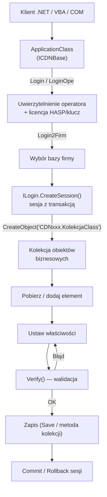
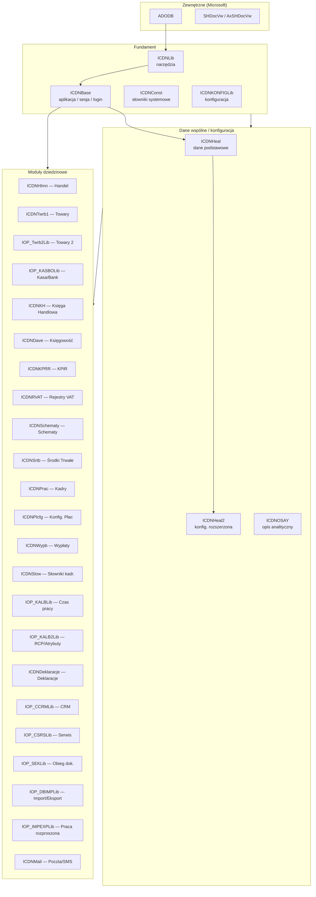
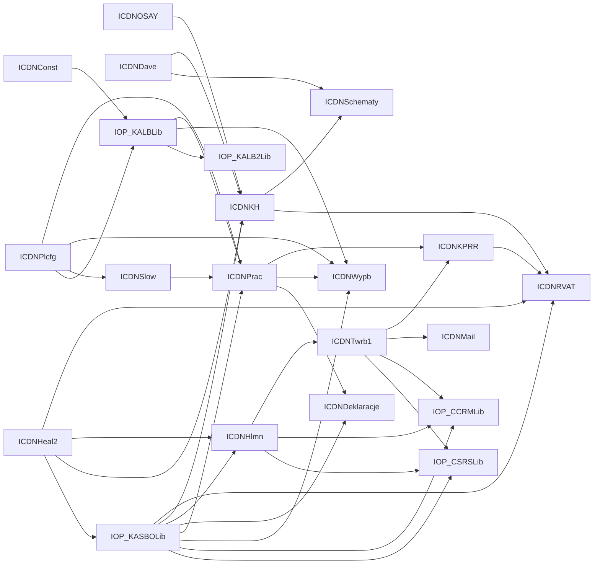
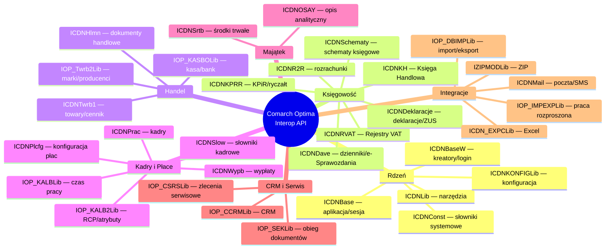
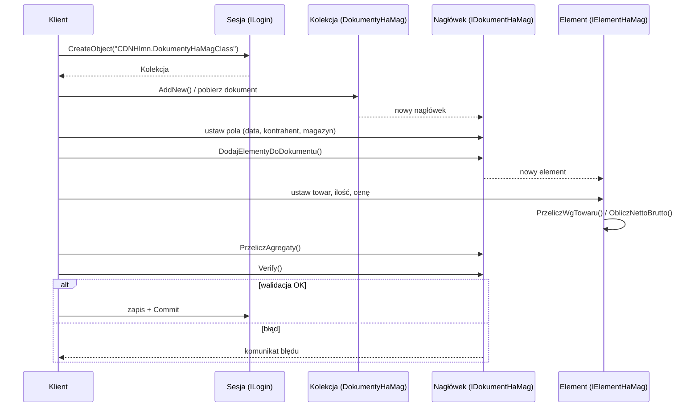
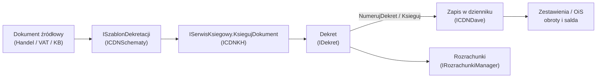

# Diagramy interfejsu COM dla Comarch ERP Optima
- draftId: `draft_2026-07-08_3386cae6_diagramy-interfejsu-com-dla-comarch-erp-optima`
- kbNamespace: `ComarchOptimaReference`
- status: `promoted`
- promotedAt: `2026-07-10T06:01:31.768Z`
- tags: `COM interfejs`, `diagramy`, `API`, `Optima`, `Mermaid`, `architektura`, `dokumentacja techniczna`
- reviewNote: Approved from daily ops
## Content
# Comarch ERP Optima — Interop (COM API) — Diagramy (Mermaid)

Diagramy uzupełniające bazę wiedzy `KB_Interop_Comarch_Optima.md`.
Wersja produktu: **2026.5.1.6382** · 38 assembly .NET (COM Interop).

---

## 1. Przepływ inicjalizacji i sesji (punkt wejścia)

Typowa sekwencja od uruchomienia po operacje na obiektach biznesowych.

---

## 2. Architektura warstwowa

Moduły ułożone w warstwy: od fundamentu po moduły dziedzinowe.

---

## 3. Istotne zależności międzymodułowe

Zależności dziedzinowe (pominięto wszechobecny fundament `ICDNBase` / `ICDNLib` / `ICDNHeal`, aby uwidocznić powiązania biznesowe). Strzałka **A → B** = „B używa A".

---

## 4. Mapa obszarów biznesowych

---

## 5. Wzorzec pracy z obiektem biznesowym (dokument nagłówek/element)

---

## 6. Cykl księgowania dokumentu

